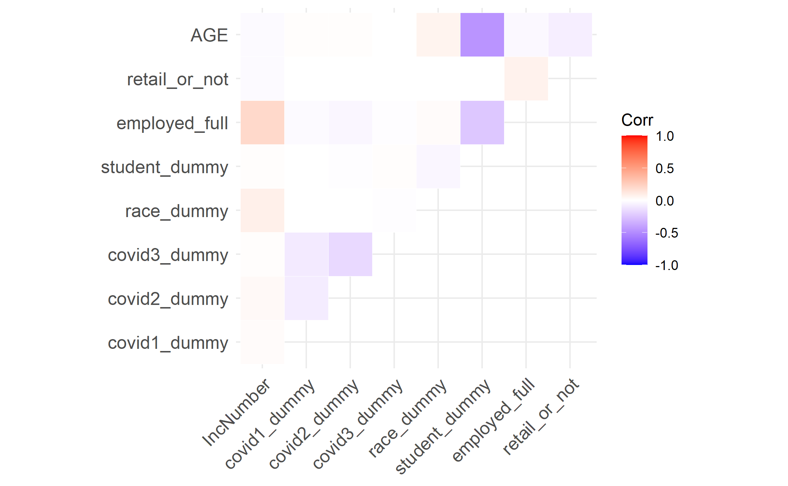
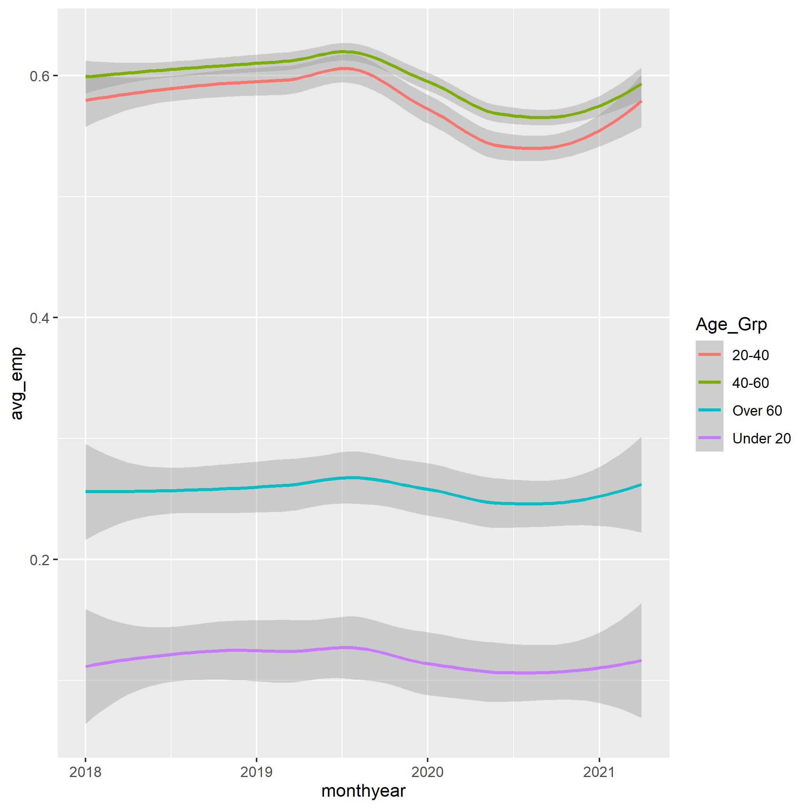

```{r setup, include=FALSE}
knitr::opts_chunk$set(echo = TRUE)
```


```{r, include = FALSE}
library(fixest)
library(ggplot2)
library(tidyverse)
library(vtable)
library(Ecdat)
library(ggstance)
library(multcomp)
library(NHANES)
library(corrplot)
library(patchwork)
library(haven)
library(marginaleffects)
library(effects)
library(DAMisc)
library(kableExtra)
```

## Data Used:
This Data set is pulled from the IPUMS data base, and tracks demographic, employment and income information from 2019 to present. 
We utilized the Current Population Survey from Ipums to gather this information (Cited: Sarah Flood, Miriam King, Renae Rodgers, Steven Ruggles and J. Robert Warren. Integrated Public Use Microdata Series, Current Population Survey: Version 7.0 [dataset]. Minneapolis, MN: IPUMS, 2020. https://doi.org/10.18128/D030.V7.0)


```{r}
clean_df<- read_csv('../RawData/final_clean.csv')

```


## Exploratory Data Analysis: Why we are running our specific analysis:


### EDA for Question 1:
```{r}
#2 visuals


```


### EDA for Question 2:

The following 2 plots look at over all unemployment as well as industry comparisons for loss of full time jobs.

{width=625px}
We see from the above visual that we have an understandable spike in jobs being lost at around the beginning of April, which is to be anticipated, as well as a rise in non-lay off job losses around June of 2020. This almost wave like pattern re-affirms our confidence in using dummies for the covid waves, as we can certainly see their impact here as well as on income.


Upon closer observation, it also appears that retail_trade jobs (1) did suffer a dip, but proportionally it was not as severe as the other industries.This may be due to the fact that so little of our sample worked in retail to begin with. 

{width=700px}


### EDA for Question 3:
{width=625px}


In trying to establish how income has changed since covid began impacting the economy we can look at the correlation between income and other attributes within the data. Not surprisingly there is a strong positive tie between employment and income, and a negative correlation with the covid waves as well as student status. 

{width=500px}


When it comes to the age breakdown of who is employed it seems that even through the dip in average employment rate for all groups the same trends appear in that traditional working ages between 20-60 are mostly employed. 


2 How the analyses answer the question being asked, and what the result is: 3 Carefully interpreting the results: 4 Presenting the results in an appealing way. Graphs are great, sumtable() is great, export_summs() is great - put a little effort into formatting tables and figures to make them look nice! At the very least, variable names should be in English rather than statistics-package (‘Education’ not ‘EDUC’). If you aren’t comfortable enough with ggplot to make its visualizations look nice, feel free to make graphics in Excel or Tableau or anything you like, and include them in your RMarkdown doc as images. Econometric analyses should be in R.


## Models and Analysis:

### Methodology and Interpretation Question 1:
```{r}


```

### Assumptions and reasoning Question 1:


### Methodology and Interpretation Question 2:

The official question is "How has retail fared relative to other industries?", which I interpretted in the direction of employment status. The data set I focused on had items that we felt would be worth controlling for, like region and the year and month, along with the individual waves of covid, which would certainly be an endogenous variable that would impact if people were able to get any variety of employment. I also wanted to control for Age, Sex and Race in my final model. Additionally, since this is survey data, utilizing the weights is crucial to make sure that we don't introduce any extra back doors. 
```{r}
#Dummies and Controls
ques2 <- clean_df %>% dplyr::select(YEAR, MONTH, monthyear, CPSID, WTFINL, AGE, SEX, RACE, CLASSWKR, WHYUNEMP, WKSTAT, INDNAME, covid1_dummy, covid2_dummy, covid3_dummy, REGION) 

ques2$unemper <- ifelse(ques2$WKSTAT %in% c("Unemployed, seeking part-time work", "Unemployed, seeking full-time work"), 1, 0)

avg_unemper <- mean(ques2$unemper) #looking for what the probability of being generally unemployed is

ques2$retail_or_not <- ifelse(ques2$INDNAME %in% c("Retail Trade"), 1, 0)

ques2$covid_april <- ifelse(ques2$monthyear >= '2020-04-01', 1, 0) # the 1 is layoffs in #april
```


#### First model verifying controls:
unemper is our dependent model, which I took both seeking full time and seeking part time responses. It is possible that I could have included responses for people that had gone from full time down to part time, but I felt that full unemployment measures would better describe the health of retail compared to other industries.
```{r}
ques2m1 <- feols(unemper ~ retail_or_not + YEAR + MONTH | REGION + covid1_dummy + covid2_dummy + covid3_dummy, 
                 data = ques2, weights = ques2$WTFINL, vcov='hetero')


etable(ques2m1)


resid_1 <- resid(ques2m1)
plot(fitted(ques2m1), resid_1)
```


Observing the impact of retail_or_not, a dummy variable, it is apparent that there is a minor yet significant impact from being in retail compared to other industries, and how that relates to becoming unemployed. The residuals plot shows us that this multivariate model doesn't fit well with a dependent variable that is binary. Due to the heteroskedasticity we see it makes sense to try a logit model next to see how that performs. With our current Fixed Effects, it also becomes important to verify that they are all useful, so we proceed to do some WALD tests.


```{r}
wald(ques2m1, c("YEAR", "MONTH")) #both are useful
wald(ques2m1, c("REGION")) # All regions are significant
wald(ques2m1, c("covid1_dummy", "covid2_dummy", "covid3_dummy")) # all are significant and useful
```
The Wald Tests show that Year and Month are both jointly significant, which makes a lot of sense since the impact of Covid has been very time reliant. From there we also see that Region is also a significant control, which seems logical, as Covid impacted different regions in very specific ways. Lastly, our very useful dummy variables also work well as controls which I am sure helps present a different set of time control compared to Month and Year, making these dummies particularly useful. 


#### Second Model Logit:
For the second model, a Logit with Binary Dependent Variable, the controls are relatively the same as the first model. I was able to still include the weights argument, and get an output on Marginal Fixed Effects. This model enables us to interpret the impact of retail employment on being unemployed through probability.
```{r}
ques2logit <- feglm(unemper ~ retail_or_not + YEAR + MONTH | REGION + covid1_dummy + covid2_dummy + covid3_dummy, 
                 data = ques2, weights = ques2$WTFINL, family = binomial(link = 'logit')) # 

log_m <- marginaleffects(ques2logit)
log_1 <- summary(log_m)

kable(x=log_1, format = "html", caption = "Low Marginal Effect of Retail or Not")
```

From the Marginal Effect we see that the impact is fairly low, and has little to no significance. Upon observing this, reflecting on our real question brings in a time parameter. We are controlling for time currently, but it is relevant to think of utilizing fixed effects across a lot of our demographic variables, which leave a lot of open back doors. Additionally, observing our changes over time would be best to do with a dummy variable. I want to see what the impact of covid was on retail employment compared to other industries, so isolating that time in our model is crucial. 


#### Final Model Logit with Interaction Term:
For the final Model I added in the extra set of controls (Age, Sex, Race) as fixed effects. These are all spanning categories for our variable of interest (unemployment for retail), so controlling for them should help to close back doors. Since I am not concerned about their coefficient power or impact on the model, no WALD test will be used to verify the power of impact. 
Additionally, I create another dummy variable for April, to see what the interaction is between being before and after April is on Retail employment compared to other industries. Of course the weights from the data are also still present in this final model. 
```{r}
# Creating a dummy variable to see before and during covid. I will keep the assumption that March was the first wave of covid, but 
#the layoffs would have initiated after covid had lingered, so I am marking in April:

ques2logit2 <- feglm(unemper ~ retail_or_not*covid_april + YEAR + MONTH + covid1_dummy + # implementing "|" makes prediction NA 
                     covid2_dummy + covid3_dummy + AGE + SEX + RACE + REGION, 
                   data = ques2, weights = ques2$WTFINL, family = binomial(link = 'logit')) # 

```


Using Predictions formatting to gather probabilities of our scenarios:
```{r}
#pred <- predictions(ques2logit2, variables = list(retail_or_not=c(0,1), covid_april=c(1,0)))
sum1 <- summary(predictions(ques2logit2, newdata = datagrid(retail_or_not= 1, covid_april = 1)))
kable(x=sum1, format = "html", caption = "During Covid Retail Unemployment")
sum2 <- summary(predictions(ques2logit2, newdata = datagrid(retail_or_not= 1, covid_april = 0)))
kable(x=sum2, format = "html", caption = "Before Covid Retail Unemployment")
```

Interpretation: 
These are overall probabilities. For the first scenario, if everyone was a retail worker after April 1st, we would anticipate an unemployment rate of 4.85%
Second Scenario indicates that for retail workers before the pandemic the risk of unemployment was 2.3%, meaning if we only had 1000 retail workers pre pandemic, we would expect 23 of them to be unemployed.

So there is certainly an increased risk of unemployment overtime for retail workers. 

```{r}
sum3 <- summary(predictions(ques2logit2, newdata = datagrid(retail_or_not= 0, covid_april = 0)))
kable(x=sum3, format = "html", caption = "Before Covid Non-Retail Unemployment")
sum4 <- summary(predictions(ques2logit2, newdata = datagrid(retail_or_not= 0, covid_april = 1)))
kable(x=sum4, format = "html", caption = "During Covid Non-Retail Unemployment")
```


Interpretation:
These are also general probabilities.
First Scenario, if no one was a retail employee, before April of 2020 we would anticipate having an unemployment rate of 1.42%.
Second summary shows that non retail workers post April 1st would anticipate an unemployment rate of 3.09%, which is lower than for retail workers, however we do see an increased growth of risk for unemployment in both retail and non retail. 

```{r}
avg_unemper
```
We see that retail in general has a post covid higher than average rate of unemployment from 3.22% to 4.85%

In our interaction term we see that if the time is in April 2020 or later that there is an increased risk of unemployment across all industries, with retail having the highest risk. 


Here is a visual which portrays the accuracy of the final logit model. 
```{r}
ques2 <- ques2 %>% mutate(logit_predict2 = predict(ques2logit2, type="response", newdata=ques2))
ques2 <- ques2 %>% mutate(logit_index2 = predict(ques2logit2, type="link", newdata=ques2))


ques2 %>% ggplot() +
  geom_line(aes(x=logit_index2, y=logit_predict2)) + geom_smooth(aes(x=logit_index2, y=unemper)) +
  labs(x = "Logit Index", y = "Logit Prediction", title = "Overlap Accuracy of Model Predictions")
```
The curve and predicted values are relatively overlapping and correct over the index, which shows that our model is relatively healthy. 

### Assumptions and reasoning Question 2:
- A key assumption from my last model is that I used April is the cut off time for before and after Covid in my interaction term. I feel that this is justified through the exploratory analysis we did which portrays how the strongest effects of Covid on income and employment began after March, in April. Additionally, I feel this is justified because logically speaking, closures, stay at home orders and nation wide lock-downs didn't start until the very tail end of March. 

- Logit models also tend to be less accurate to either end of the tale of the model, which is worth recognizing as the index of our model is being observed across a large span of time. It may be to our benefit that the timing of our covid variable is not on the ends of our model. Additionally, Logit Models have the incidental parameter issue, where they tend to be marginally less effective with lots of different fixed effect controls. Our model does have a lot of fixed effect controls, but we have deemed them all necessary as there is no redundancy. 

-Assumptions about employment types being that I have only chosen to observe loss of job completely, compared to observation of loss of hours. Our data does include information on people going from full time work to part time work, however I felt that was unlikely to be as impactful or important to industry health as people that lost their jobs outright. 

-Assumptions about other industries are that there are no serious outliers that would cripple the comparison between non retail and retail jobs. Our EDA did verify that the average spread of job loss was unique between industries, but also didn't have any that were completely untouched or outliers of lost jobs. 

Methodology and Interpretation Question 3:
```{r}

```

3 Carefully interpreting the results


### Assumptions and reasoning Question 3:


5 Acknowledging the assumptions you are making in each analysis, how plausible those assumptions are in the context of your data, and any evidence you can provide backing up those assumptions

6 After doing all analyses related to a given question, provide a generalized answer to the main questions.

I do not expect indisputable flawless results - the data can only do so much, and we always have to rely on assumptions. However, an analysis with big flaws goes down a lot easier if you can very accurately interpret the results, point out the flaws or implausible assumptions, discuss how those flaws affect the results, and perhaps suggest an improved analysis you would run if it were feasible. Don’t claim more than your results can actually show.


## Results and Further Research:
For Question 1....


In regards to Question 2, "How has retail fared relative to other industries?"  We see that there is a significant probability difference in being unemployed during the pandemic if you are in retail. During covid in retail compared to non retail workers the likely hood of being unemployed was 4.85% compared to 3.09%. This means that being in retail increased your chances of becoming unemployed, and as a whole, the industry suffered more than other industries on average when it came to unemployment. However there is a relationship between transitioning into covid and all industries suffering more job loss on average.

To further research this question, it would be very helpful to gather more data on the different types of retail workers, at an even larger scale, and see who from stores, malls, food centers and other retail services suffered the most at large scale. Our sample here doesn't quite capture the millions of retail-like workers that must have gone without a paycheck at some point in time. It would also be very interesting to see if and how these individuals re-entered the work place following the de-escalation of covid. 


For Question 3...

Retail needs to worry about who has money to spend - what has changed about who is working and earning money?

The trends we saw before the first covid spikes at the end of the first quarter 2020 in regards to the workforce and income distribution still exist now that things are returning to normal in regards to the pandemic. The people who are employed and have money tend to be younger, white, and female. There were changes in every group as each wave of covid began and the recovery for everyone has been different but overall not much has changed in who has money. 

Something to consider for further research is the rate of recovery for different demographics to pre-pandemic levels. Also tracking individuals to see if people leaving an industry returned to that industry or took this as an opportunity to change careers. 


