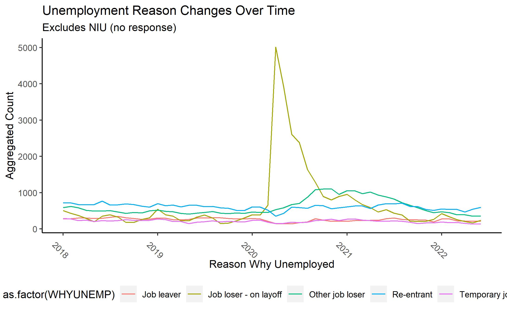
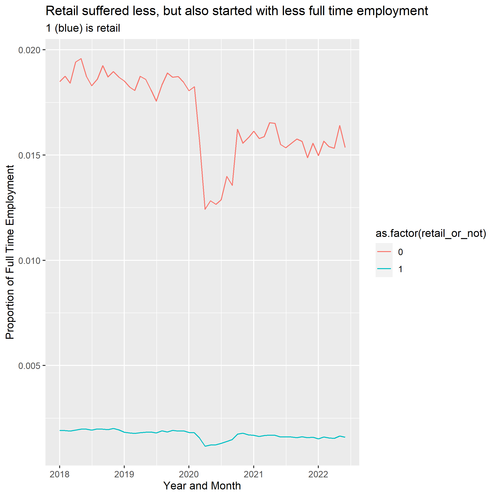

```{r setup, include=FALSE}
knitr::opts_chunk$set(echo = TRUE)
```

## Libraries:

```{r cars}
library(fixest)
library(ggplot2)
library(tidyverse)
library(vtable)
library(Ecdat)
library(ggstance)
library(multcomp)
library(NHANES)
library(corrplot)
library(patchwork)
library(haven)
library(marginaleffects)
```

## Data Used:
```{r}
clean_df<- read_csv('../RawData/final_clean.csv')

```

Format the writeup as a report with sections for the main questions, not a list of bullet points. Information to include:

1 Why you are running the analyses you are running

## Exploratory Data Analysis:


### EDA for Question 1:
```{r}
#2 visuals


```


### EDA for Question 2:

{width=625px}

Upon closer observation, it also appears that retail_trade jobs (1) did suffer a dip, but proportionally it was not as severe as the other industries.

{width=625px}


### EDA for Question 3:
```{r}


# 2 Visuals

```


2 How the analyses answer the question being asked, and what the result is: 3 Carefully interpreting the results: 4 Presenting the results in an appealing way. Graphs are great, sumtable() is great, export_summs() is great - put a little effort into formatting tables and figures to make them look nice! At the very least, variable names should be in English rather than statistics-package (‘Education’ not ‘EDUC’). If you aren’t comfortable enough with ggplot to make its visualizations look nice, feel free to make graphics in Excel or Tableau or anything you like, and include them in your RMarkdown doc as images. Econometric analyses should be in R.


## Models and Analysis:

Methodology and Interpretation Question 1:
```{r}

```

### Assumptions and reasoning Question 1:


Methodology and Interpretation Question 2:
```{r}
#Dummies and Controls
ques2 <- clean_df %>% dplyr::select(YEAR, MONTH, monthyear, CPSID, WTFINL, AGE, SEX, RACE, CLASSWKR, WHYUNEMP, WKSTAT, INDNAME, covid1_dummy, covid2_dummy, covid3_dummy, REGION) 

ques2$unemper <- ifelse(ques2$WKSTAT %in% c("Unemployed, seeking part-time work", "Unemployed, seeking full-time work"), 1, 0)

avg_unemper <- mean(ques2$unemper) #looking for what the probability of being generally unemployed is

ques2$retail_or_not <- ifelse(ques2$INDNAME %in% c("Retail Trade"), 1, 0)
```

First model verifying controls
```{r}
ques2m1 <- feols(unemper ~ retail_or_not + YEAR + MONTH | REGION + covid1_dummy + covid2_dummy + covid3_dummy, 
                 data = ques2, weights = ques2$WTFINL, vcov='hetero')


etable(ques2m1)


resid_1 <- resid(ques2m1)
plot(fitted(ques2m1), resid_1)
```


```{r}
wald(ques2m1, c("YEAR", "MONTH")) #both are useful
wald(ques2m1, c("REGION")) # All regions are significant
wald(ques2m1, c("covid1_dummy", "covid2_dummy", "covid3_dummy")) # all are significant and useful
```


Second Model Logit:
```{r}
ques2logit <- feglm(unemper ~ retail_or_not + YEAR + MONTH | REGION + covid1_dummy + covid2_dummy + covid3_dummy, 
                 data = ques2, weights = ques2$WTFINL, family = binomial(link = 'logit')) # iremoved the weights

log_m <- marginaleffects(ques2logit)
summary(log_m)

```

Final Model Logit with INteraction Term
```{r}
# Creating a dummy variable to see before and during covid. I will keep the assumption that March was the first wave of covid, but 
#the layoffs would have initiated after covid had lingered, so I am marking in April:

ques2$covid_april <- ifelse(ques2$monthyear >= '2020-04-01', 1, 0) # the 1 is layoffs in #april

ques2logit2 <- feglm(unemper ~ retail_or_not*covid_april + YEAR + MONTH | REGION + covid1_dummy + covid2_dummy + covid3_dummy, 
                 data = ques2, weights = ques2$WTFINL, family = binomial(link = 'logit')) # iremoved the weights

log_m2 <- marginaleffects(ques2logit2)
summary(log_m2)

etable(ques2logit, ques2logit2)
```


```{r}
ques2 <- ques2 %>% mutate(logit_predict2 = predict(ques2logit2, type="response", newdata=ques2))
ques2 <- ques2 %>% mutate(logit_index2 = predict(ques2logit2, type="link", newdata=ques2))


ques2 %>% ggplot() +
  geom_line(aes(x=logit_index2, y=logit_predict2)) + geom_smooth(aes(x=logit_index2, y=unemper))
```
Interpreting this model...

### Assumptions and reasoning Question 2:
- APril assumption

Methodology and Interpretation Question 3:
```{r}

```

3 Carefully interpreting the results


### Assumptions and reasoning Question 3:


5 Acknowledging the assumptions you are making in each analysis, how plausible those assumptions are in the context of your data, and any evidence you can provide backing up those assumptions

6 After doing all analyses related to a given question, provide a generalized answer to the main questions.

I do not expect undisputable flawless results - the data can only do so much, and we always have to rely on assumptions. However, an analysis with big flaws goes down a lot easier if you can very accurately interpret the results, point out the flaws or implausible assumptions, discuss how those flaws affect the results, and perhaps suggest an improved analysis you would run if it were feasible. Don’t claim more than your results can actually show.