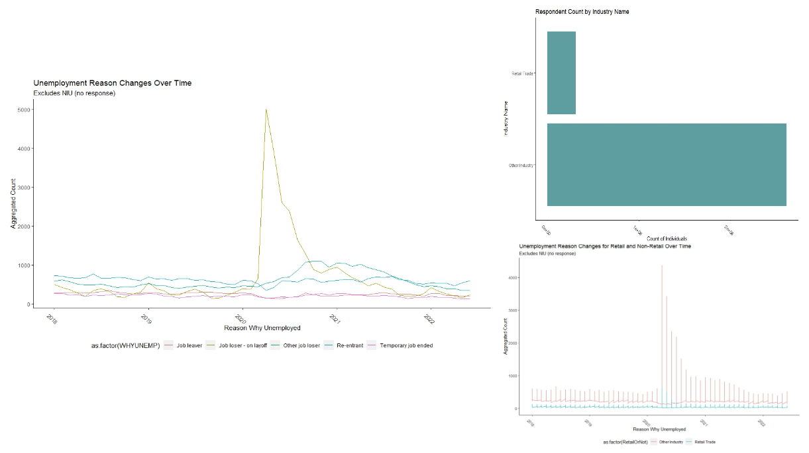
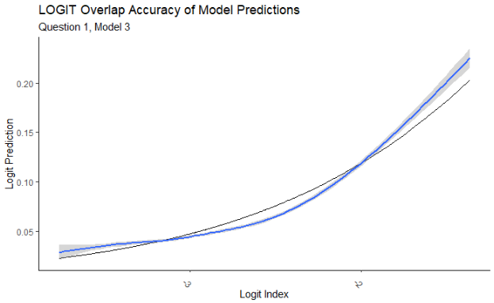
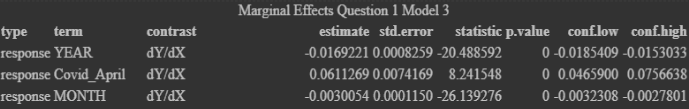
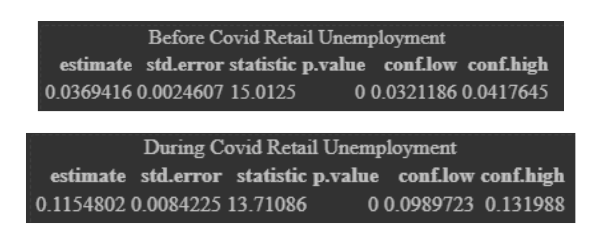
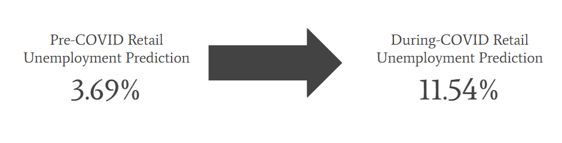
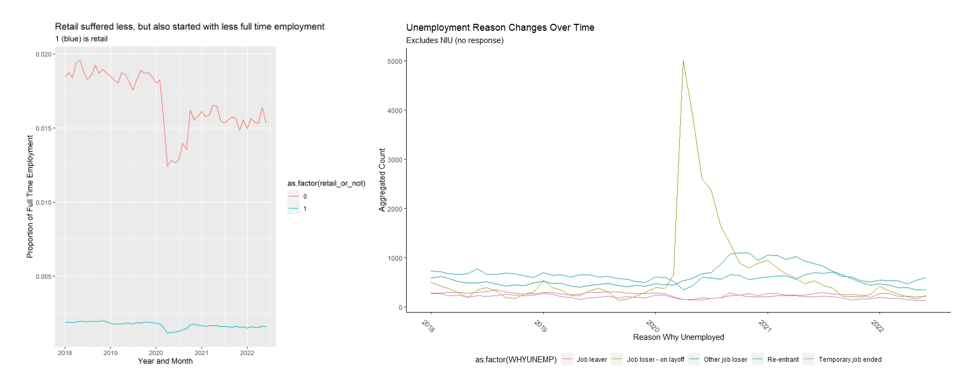
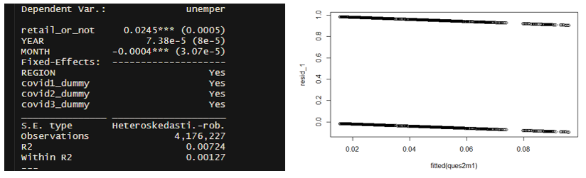
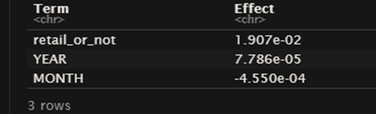
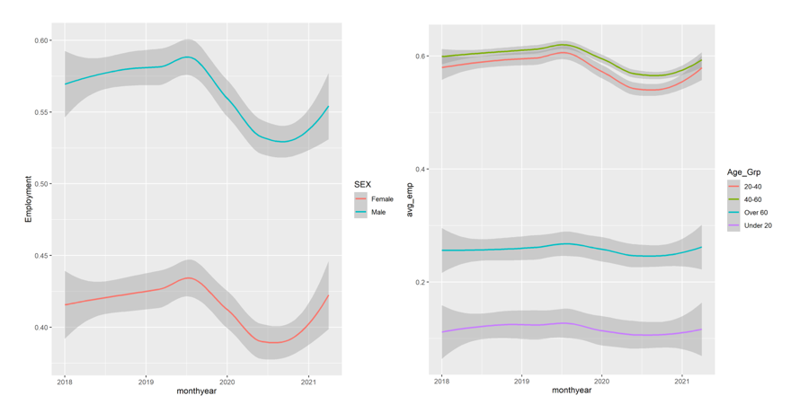

```{r setup, include=FALSE}
knitr::opts_chunk$set(echo = FALSE)
```

```{r Clear Environment}

rm(list = ls(all = TRUE)) 
```

```{r Packages, message=FALSE, warning=FALSE}
options(htmltools.dir.version = FALSE) 
knitr::opts_chunk$set(echo = FALSE, dev.args = list(png = list(type = "cairo")), warning = FALSE, message = FALSE, fig.width = 8, fig.height = 6)
theme_metro <- function(x) {
  theme_classic() + 
  theme(panel.background = element_rect(color = '#FAFAFA',fill='#FAFAFA'),
        plot.background = element_rect(color = '#FAFAFA',fill='#FAFAFA'),
        text = element_text(size = 16),
        axis.title.x = element_text(hjust = 1),
        axis.title.y = element_text(hjust = 1, angle = 0))
}
theme_metro_regtitle <- function(x) {
  theme_classic() + 
  theme(panel.background = element_rect(color = '#FAFAFA',fill='#FAFAFA'),
        plot.background = element_rect(color = '#FAFAFA',fill='#FAFAFA'),
        text = element_text(size = 16))
}
library(fixest)
library(ggplot2)
library(tidyverse)
library(vtable)
library(Ecdat)
library(ggstance)
library(multcomp)
library(NHANES)
library(corrplot)
library(patchwork)
library(haven)
library(marginaleffects)
library(effects)
library(DAMisc)
library(kableExtra)
library(directlabels)
library(ggdag)
```


```{r data load, message=FALSE, warning=FALSE, include=FALSE}
clean_df<- read_csv('../RawData/final_clean.csv')

q1_df <- clean_df %>%
  dplyr::select(YEAR, MONTH, monthyear, CPSID, PERNUM, WTFINL, CLASSWKR, WHYUNEMP, WKSTAT,
                REGION, INDNAME, covid1_dummy, covid2_dummy, covid3_dummy) %>%
  mutate(Unemployed = ifelse(WKSTAT %in% c("Unemployed, seeking part-time work", "Unemployed, seeking full-time work"),
                           1, 0)) %>%
  mutate(JobLost = ifelse(WHYUNEMP %in% c("Job loser - on layoff", "Other job loser"), 1, 0)) %>%
  mutate(RetailIndustry = ifelse(INDNAME %in% c("Retail Trade"), 1, 0)) %>%
  mutate(Covid_April = ifelse(monthyear >= '2020-04-01', 1, 0)) %>%
  filter(RetailIndustry == 1)


ques2 <- clean_df %>% dplyr::select(YEAR, MONTH, monthyear, CPSID, WTFINL, AGE, SEX, RACE, CLASSWKR, WHYUNEMP, WKSTAT, INDNAME, covid1_dummy, covid2_dummy, covid3_dummy, REGION)

#Should I control for region and for covid dummies?

ques2$employed_full <- ifelse(ques2$WKSTAT %in% c("Full-time hours (35+), usually full-time", "Full-time hours (35+), usually part-time for economic reasons", "Full-time hours (35+), usually part-time for non-economic reasons"), 1, 0)


ques2$job_loser <- ifelse(ques2$WHYUNEMP %in% c("Job loser - on layoff", "Other job loser"), 1, 0)

ques2$retail_or_not <- ifelse(ques2$INDNAME %in% c("Retail Trade"), 1, 0)

ques2$unemper <- ifelse(ques2$WKSTAT %in% c("Unemployed, seeking part-time work", "Unemployed, seeking full-time work"), 1, 0)

ques2$covid_april <- ifelse(ques2$monthyear >= '2020-04-01', 1, 0)


q3_df <- clean_df %>% 
  mutate(sex_binary = ifelse(SEX =="Female", 1, 0)) %>% 
  mutate(married = ifelse(MARST == "Married, spouse present", 1, 0)) %>% 
  mutate(Employed = ifelse(WKSTAT %in% c("Full-time hours (35+), usually full-time", 
                                         "Full-time hours (35+), usually part-time for economic reasons",
                                         "Full-time hours (35+), usually part-time for non-economic reasons"),
                           1, 0)) %>% 
  mutate(all_covid = ifelse(monthyear >= '2020-03-01', 1, 0)) %>% 
  dplyr::select(c(WKSTAT, Employed, IncNumber,YEAR, MONTH, race_dummy, student_dummy, AGE, sex_binary, 
                  married, NCHILD,covid1_dummy, covid2_dummy, covid3_dummy, REGION, all_covid))


```


# Contents

- How was COVID affected the health of the retail industry, as measured by employment?
    - Exploring Data
    - Why we are running this analysis
    - Assumptions
    - Testing
    - Results
    - Interpretation
- How has retail fared relative to other industries?
    - Assumption
    - Testing
    - Results
    - Interpretation
- Retail needs to worry about who has money to spend - what has changed about who is working and earning money?
    - Assumption
    - Testing
    - Results
    - Interpretation


---


#Question 1

- How has COVID affected the health of the retail industry, as measured by employment? 


---


# Data Exploration

- Large spike in early 2020 of Unemployment
- Significant portion of observations are retail employees
- Retail vs non-retail similar trends of unemployment over time





---

# Why are we running these analyses?

- Colloquially and in media, certain industries ‘hit hard’ by COVID
- Retail requires employees to be ‘in person’ in order to survive as a business
- Employment is a good proxy for determining industry health
- COVID is a radical change - we can observe changes over time
- We want to determine how probable the onset of COVID and the accompanying public health policy changes impacted employment for the retail industry - using employment as our dependent variable


---

# Question 1 Assumptions

- Filter observations to only those in retail
- COVID ‘begins’ on April 1, 2020
- LOGIT model will help answer question best
    - Multiple linear regression not the best solution to answer the question
    - Incidental parameter
    
---


# Question 1 Regression Testing


- Model 1:
```{r, echo = TRUE}
q1_m1 <- feols(Unemployed ~ YEAR + MONTH + covid1_dummy + covid2_dummy 
               + covid3_dummy, data = q1_df, 
               weights = q1_df$WTFINL, vcov = 'hetero')
```

- Model 2:
```{r, echo = TRUE}
q1_m2 <- feols(Unemployed ~ YEAR*Covid_April + YEAR + MONTH + REGION 
               + covid1_dummy + covid2_dummy + covid3_dummy, data = q1_df, 
               weights = q1_df$WTFINL, vcov = 'hetero')
```

- Model 3: our chosen model that ultimately answers question 1
```{r, echo = TRUE}
q1_m3 <- feglm(Unemployed ~ YEAR*Covid_April + YEAR + MONTH + REGION 
               + covid1_dummy + covid2_dummy + covid3_dummy, data = q1_df, 
               weights = q1_df$WTFINL, family = binomial(link = 'logit'))
```


---


# Question 1 Results

- Model Accuracy Chart



---

# Question 1 Results

- Marginal Effects Summary



- Results of Before and During (After April 1, 2020)



---


# Interpretation: Question 1

Based on this regression and analysis, we see that pre-COVID (before April 1st, 2020), we would anticipate an unemployment rate of 3.69%, and post-COVID, we anticipate an unemployment rate of 11.54% which is a massive spike. This aligns much more closely to what we saw in our exploratory data analysis charts.



---


#Question 2


- How has retail fared relative to other industries?
    - Retail has struggled with consumer demand during covid, which has in turn caused employees to lose hours or their jobs:
    




---


# Why are we running these analyses?

- As the images on the last slide portrayed, all industries suffered from the covid layoffs, however, I wanted to compare and contrast retail against all other industries in general.
- Dummy variable for retail or non retail and Dummy for April before/after

- Model #1 is just a generalized multivariate model, which progresses into a logit model. 


---

# Question 2 Assumptions

- April Assumption: Job loss takes time
- Assumptions about other industries: No massive outliers
- Assumption about employment type: The largest impact on an industry is a layoff
- Incidental Parameter: Assumption about multiple Logit Fixed Effects.


---

# Question 2 Regression Testing


- Model 1: General Multivariate
```{r, echo = TRUE}
q2_m1 <- feols(unemper ~ retail_or_not + YEAR + MONTH | REGION + covid1_dummy 
      + covid2_dummy + covid3_dummy,  data = ques2, 
      weights = ques2$WTFINL, vcov='hetero')
```

- Model 2: Binary Dependent Logit
```{r, echo = TRUE}
q2_m2 <- feglm(unemper ~ retail_or_not + YEAR + MONTH | REGION + covid1_dummy 
      + covid2_dummy + covid3_dummy, data = ques2, 
      weights = ques2$WTFINL, family = binomial(link = 'logit'))
```

- Model 3: Interaction Term Logit
```{r, echo = TRUE}
q2_m3 <- feglm(unemper ~ retail_or_not*covid_april + YEAR + MONTH + covid1_dummy
      +  covid2_dummy + covid3_dummy + AGE + SEX + RACE + REGION, 
      data = ques2, weights = ques2$WTFINL, family = binomial(link = 'logit'))
```


---

# Question 2 Results: Model 1




---

# Question 2 Results: Model 2

- Results are low Impact, which gives reason to look at time based interactions




---


# Interpretation of Selected Model
- Model #3: Interpreting Logit Interaction Terms
- Utilized Inter Effect Code:  
    - summary(predictions(ques2logit2, newdata = datagrid(retail_or_not= 1, covid_april = 1)))
    - First Scenario indicates that for retail workers before April 1st the risk of unemployment was 2.3%, meaning if we only had 1000 retail workers pre pandemic, we would expect 23 of them to be unemployed.
    - Second Scenario if everyone was a retail worker after April 1st, we would anticipate an unemployment rate of 4.85%
    - Third scenario, if no one was a retail employee, before April 1st we would anticipate having an unemployment rate of 1.42%.
    - Fourth summary shows that non retail workers post April 1st would anticipate an unemployment rate of 3.09%, which is lower than for retail workers.


---

# Question 3

- Retail needs to worry about who has money to spend - what has changed about who is working and earning money?

---

# Why are we running these analyses?
- The labor force is still very much white, male, and between 20 and 60 years of age
- However the demographics are changing slightly:
    - Leaning slightly more female than before
    - Leaning slightly younger than before




---

# Why are we running these analyses?

- By looking at who is employed at each point in the pandemic we can see how demographics are shifting in the labor force. 
- Using income and employment separately might help show small differences in not just who is working but who has income that they can then spend. 


---

# Question 3 Assumptions

- People leaving the labor force stop reporting their income so as people are laid off the average income is going to shift up as lower earners are lost from the data set. 
- The variables created to mark the various waves of Covid identify a general enough time frame that they apply to every region regardless of when that region actually experienced the wave.
- A binary variable to determine employment is adequate for these regression models to be accurate enough for our purposes. 


---


# Question 3 Regression Testing
- Model 1: 
```{r, echo = TRUE}
q3_m1 <- feols(Employed ~ race_dummy + student_dummy + AGE + sex_binary 
               + covid1_dummy + covid2_dummy + covid3_dummy, data=q3_df)
```
- Model 2:
```{r, echo = TRUE}
q3_m2 <- feols(IncNumber ~ race_dummy + student_dummy + AGE + sex_binary
               + covid1_dummy + covid2_dummy + covid3_dummy, data=q3_df)
```
- Model 3: 
```{r, echo = TRUE}
q3_m3 <- feols(Employed ~ all_covid + AGE + race_dummy + sex_binary
               +  I(all_covid*AGE)+ I(all_covid*race_dummy) 
               + I(all_covid*sex_binary), data=q3_df)
```
- Model 4: 
```{r, echo = TRUE}
q3_m4 <- feols(IncNumber ~ all_covid + AGE + race_dummy + sex_binary
               + I(all_covid*AGE) + I(all_covid*race_dummy) 
               + I(all_covid*sex_binary),  data=q3_df)
```
---

# Question 3 Results: Models 1 and 2


- Models 1 and 2 did not include interaction terms and show that overall the demographics of the labor force leaned younger, whiter, and male. They also show that Covid played  a negative on employment as expected.  

```{r, echo = TRUE}
etable(q3_m1, q3_m2)
```


---

# Question 3 Results: Models 3 and 4

- Models 3 and 4 did include interaction terms and show that within the pandemic the demographics changed very slightly away from white and male toward other groups.  

```{r, echo = TRUE}
etable(q3_m3, q3_m4)
```

---

# Interpretation: 

- In general the labor force is made up of the same demographics.
- One important distinction is the slight increase in employment for women and non-white people relative to the period of time before March of 2020.

---

# Thank You
- We enjoyed this class and this project
- Congrats on winning Idiotest and 
